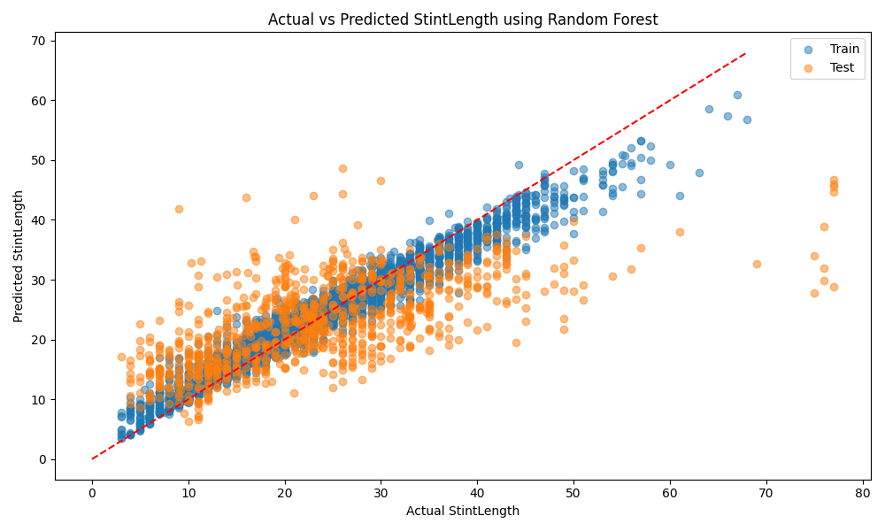
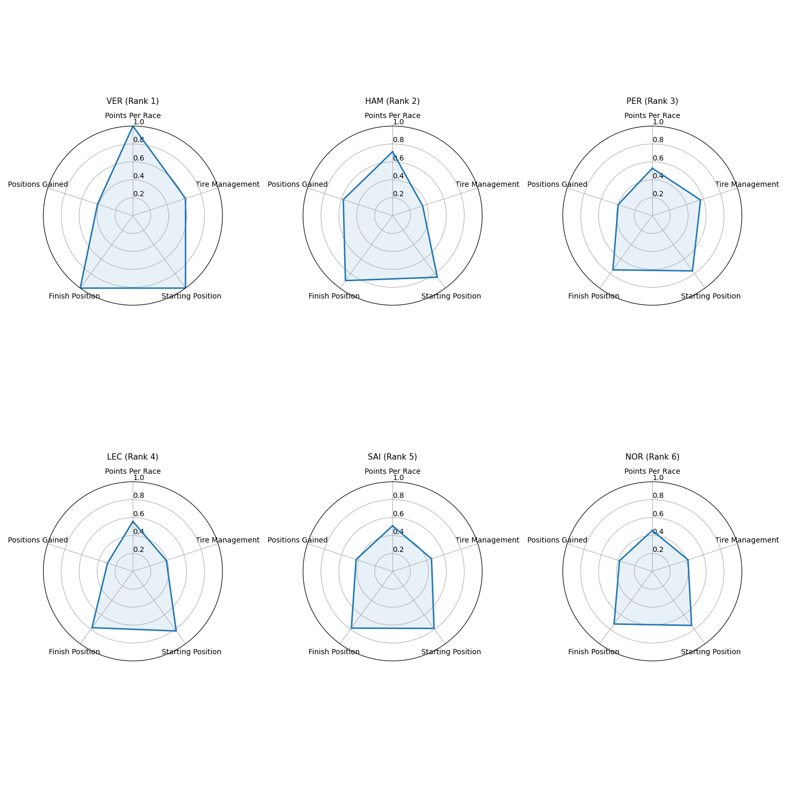
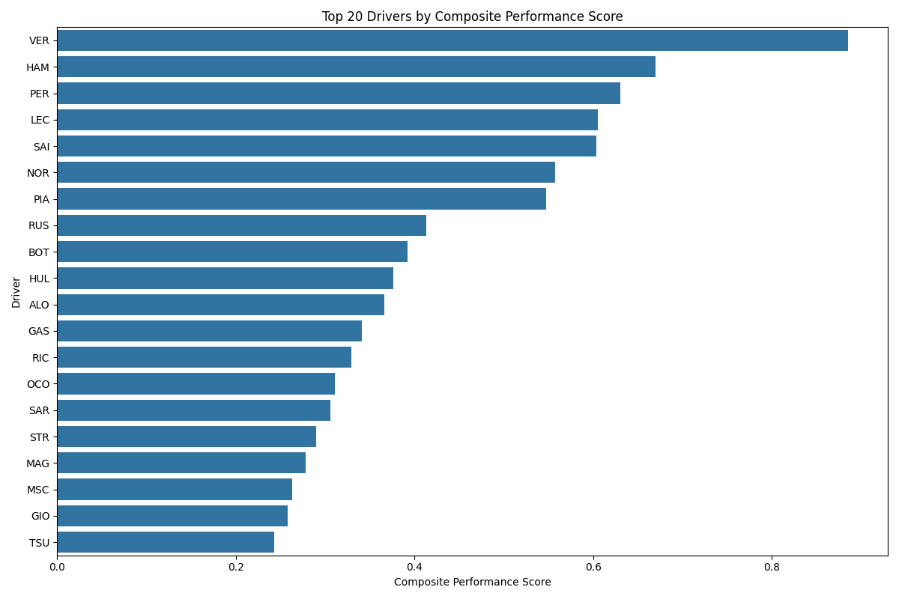
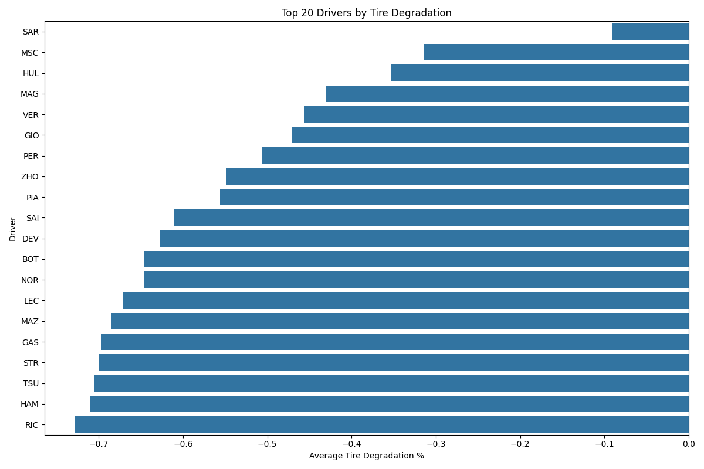

# F1Insights

F1Insights is a machine learning project focused on analyzing Formula 1 racing data to identify performance trends,
driver rankings, and tire degradation patterns.

## Overview

This project combines data collection from Formula 1 races with machine learning techniques to:

- Rank drivers based on multiple performance metrics
- Predict stint length and race points based on tire degradation and other factors
- Visualize key performance indicators for top drivers

## Tech Stack

- **Python**: Primary programming language
- **NumPy**: Used for numerical operations and calculations
- **pandas**: Used for data manipulation and analysis
- **scikit-learn**: Implemented Ridge Regression and Random Forest models
- **matplotlib/seaborn**: For data visualization
- **fastf1**: API for accessing Formula 1 race data

## Features

### Data Collection and Processing

- Collects race data for 2020-2024 seasons
- Processes tire degradation metrics
- Tracks driver performance across multiple races
- Filters out invalid laps (pit stops, safety cars)

### Performance Analysis

- Calculates composite driver scores based on weighted metrics:
    - Points per race (30%)
    - Tire management (30%)
    - Starting position (20%)
    - Finish position (20%)

### Machine Learning Models

- Predicts stint length and race points based on tire degradation and driving style
- Compares Ridge Regression and Random Forest models

## Model Performance

### Stint Length Prediction

```
Random Forest Test Performance (target = StintLength):
Train R² Score: 0.942
Test R² Score: 0.423
Train MAE: 1.848
Test MAE: 6.730

Ridge Regression Test Performance (target = StintLength):
Train R² Score: 0.397
Test R² Score: 0.329
Train MAE: 6.432
Test MAE: 7.466
```

### Race Points Prediction

```
Random Forest Test Performance (target = RacePoints):
Train R² Score: 0.913
Test R² Score: 0.307
Train MAE: 1.550
Test MAE: 4.448

Ridge Regression Test Performance (target = RacePoints):
Train R² Score: 0.144
Test R² Score: 0.155
Train MAE: 5.455
Test MAE: 5.338
```

## Driver Rankings

```
Top 20 Drivers (Overall Performance):
   Driver  CompositeScore  PointsPerRace  DegradationPct  AvgPositionsGained
1     VER        0.751312      18.951456       -0.489470           -0.077670
2     HAM        0.656032      13.549020       -0.766235            0.607843
3     LEC        0.577596      10.580000       -0.714852           -0.570000
4     SAI        0.549011       9.649485       -0.697656           -0.020619
5     PER        0.529832      10.040000       -0.556757           -0.140000
6     NOR        0.520922       8.663462       -0.738479           -0.201923
```

## Visualizations

### Random Forest Model (target=Stint Length)



### Driver Radar Charts



### Driver Composite Scores



### Tire Degradation



## Project Structure

```
F1Insights/
├── src/
│   ├── analysis/
│   │   ├── rank_drivers.py      # Driver ranking algorithms
│   │   └── train_model.py       # ML model training and evaluation
│   ├── data/
│   │   ├── collect_data.py      # Data collection from FastF1 API
│   │   └── prepare_features.py  # Feature engineering
│   ├── utils/
│   │   └── helpers.py           # Utility functions
│   ├── config.py                # Configuration settings
│   └── main.py                  # Main execution script
├── data/
│   └── processed/
│       └── tire_metrics.csv     # Processed race data
├── cache/                       # FastF1 API cache
└── README.md                    # This file
```

## Usage

1. Install requirements:
   ```
   pip install fastf1 pandas numpy scikit-learn matplotlib seaborn
   ```

2. Configure settings in `src/config.py`:
    - Set `collect_new_data` to True to fetch new race data
    - Adjust model training years
    - Modify metric weights for driver rankings

3. Run the analysis:
   ```
   python src/main.py
   ```

## Insights

- **Verstappen dominance**: Max Verstappen leads the rankings with the highest composite score. This is due to him leading in Points Per Race, Average Starting Position, and Average Finishing Poisition
- **Tire management**: Drivers that are often near the back of the pack excel in minimizing Tire Degradation
- **Position gains**: Despite scoring highly in Average Starting Position, Hamilton also performs well in Average Positions Gained during races
- **Model findings**: Random Forest models demonstrate strong training performance but show signs of overfitting
  compared to Ridge Regression

## Future Work

- Incorporate weather data for more accurate predictions
- Add metric for ability to race under pressure
- Implement predictive models for race outcome
- Explore deep learning models for lap time prediction