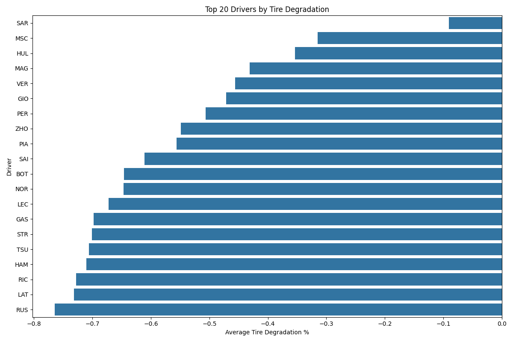

# F1Insights: Machine Learning-Powered Formula 1 Performance Analysis

> Discover driver performance patterns through advanced machine learning and comprehensive data analysis

## Overview

This project leverages machine learning models to analyze Formula 1 performance data, with a focus on:

- Developing predictive models for race outcomes and tire strategy
- Creating a composite driver ranking system based on multiple weighted metrics
- Extracting insights from tire degradation patterns across different racing conditions
- Identifying key performance indicators that distinguish top drivers

## Tech Stack

- **Python**: Primary programming language
- **NumPy**: Numerical operations and calculations
- **pandas**: Data manipulation and analysis
- **scikit-learn**: Implementation of Ridge Regression and Random Forest models with hyperparameter tuning
- **matplotlib/seaborn**: Data visualization and statistical plotting
- **fastf1**: API for accessing official Formula 1 telemetry and race data

## Machine Learning Approach

### Model Architecture

The project implements two complementary machine learning approaches:

- **Ridge Regression**: For interpretable linear relationships and baseline performance
- **Random Forest**: For capturing non-linear patterns in driver performance

### Prediction Targets

- **Stint Length Prediction**: Predicting optimal pit stop timing based on tire degradation
- **Race Points Prediction**: Estimating driver points based on performance metrics

### Feature Engineering

- **Tire degradation features**: Compound-specific degradation patterns
- **Driver performance metrics**: Relative performance, positions gained
- **Technical indicators**: Smoothed degradation, lap time statistics

## Model Performance Results

### Stint Length Prediction

```
Random Forest Performance:
Train R² Score: 0.942
Test R² Score: 0.423
Train MAE: 1.848
Test MAE: 6.730

Ridge Regression Performance:
Train R² Score: 0.397
Test R² Score: 0.329
Train MAE: 6.432
Test MAE: 7.466
```

### Race Points Prediction

```
Random Forest Performance:
Train R² Score: 0.913
Test R² Score: 0.307
Train MAE: 1.550
Test MAE: 4.448

Ridge Regression Performance:
Train R² Score: 0.144
Test R² Score: 0.155
Train MAE: 5.455
Test MAE: 5.338
```

### Key ML Insights

- **Model Comparison**: Random Forest models achieve better training performance but show signs of overfitting compared
  to the more consistent Ridge Regression models
- **Feature Importance**: Tire degradation metrics and lap time consistency emerged as the most significant predictors
- **Generalization Challenges**: The significant gap between training and testing performance highlights the challenge
  of generalizing across different F1 seasons
- **Prediction Accuracy**: Ridge regression results suggested more stable performance on unseen data despite lower
  training scores

## Performance Analysis Framework

### Data Collection and Processing

- Comprehensive collection of race data across 2020-2024 F1 seasons
- Data cleaning to filter out invalid laps (pit stops, safety car periods)
- Feature engineering to capture driver-specific patterns and race dynamics
- Statistical normalization of metrics for fair cross-season comparisons

### Weighted Performance Metrics

The composite driver ranking is based on a configurable weighted system:

- Tire management (30%)
- Points per race (30%)
- Starting position (20%)
- Finish position (20%)

This weighting system is implemented as an adjustable parameter set in `config.py`.

## Key Findings

### Driver Rankings

```
Top 10 Drivers (Overall Performance):
   Driver  CompositeScore  PointsPerRace  DegradationPct  AvgPositionsGained
1     VER        0.885443      18.951456       -0.489470           -0.077670
2     HAM        0.669411      13.549020       -0.766235            0.607843
3     PER        0.630665      10.040000       -0.556757           -0.140000
4     LEC        0.605102      10.580000       -0.714852           -0.570000
5     SAI        0.603717       9.649485       -0.697656           -0.020619
6     NOR        0.557158       8.663462       -0.738479           -0.201923
7     PIA        0.547659       7.711111       -0.620464           -0.133333
8     RUS        0.413514       6.238095       -0.843918           -0.847619
9     BOT        0.392186       4.844660       -0.740137           -1.563107
10    HUL        0.376310       1.061224       -0.387614           -1.816327
```

### Statistical Insights

- **Verstappen's dominance**: Max Verstappen leads the rankings with the highest composite score (.88), driven by
  superior points per race
- **Tire management specialists**: Data revealed that drivers often at the back of the pack excel in minimizing tire
  degradation
- **Hamilton's race day skills**: Despite high qualifying positions (2nd), Hamilton ranks 4th in positions gained per
  race (+0.61)
- **Model findings**: Random Forest models demonstrate strong training performance but show signs of overfitting
  compared to Ridge Regression generalizing across different seasons and regulations

## Visualizations

### Random Forest Model (target=Stint Length)


### Driver Radar Charts


### Driver Composite Scores


### Tire Degradation



## Project Structure

```
F1Insights/
├── src/
│   ├── analysis/
│   │   ├── rank_drivers.py      # Driver ranking algorithms
│   │   └── train_model.py       # ML model training and evaluation
│   ├── data/
│   │   ├── collect_data.py      # Data collection from FastF1 API
│   │   └── prepare_features.py  # Feature engineering
│   ├── utils/
│   │   └── helpers.py           # Utility functions
│   ├── config.py                # Configuration settings
│   └── main.py                  # Main execution script
├── data/
│   └── processed/
│       └── tire_metrics.csv     # Processed race data
├── cache/                       # FastF1 API cache
└── README.md                    # This file
```

## Usage

1. Install requirements:
   ```
   pip install fastf1 pandas numpy scikit-learn matplotlib seaborn
   ```

2. Configure settings in `src/config.py`:
    - Set `collect_new_data` to True to fetch new race data
    - Adjust model training/testing years
    - Modify metric weights for driver rankings

3. Run the analysis:
   ```
   python src/main.py
   ```

## Future ML Work

- Implement time-series forecasting for lap-by-lap prediction
- Add weather data as a feature to improve prediction accuracy in changing conditions
- Develop a race simulation model to predict race outcomes based on qualifying results
- Create driver-specific models to capture individual driving styles and adaptability
- Integrate track-specific features to account for circuit characteristics

